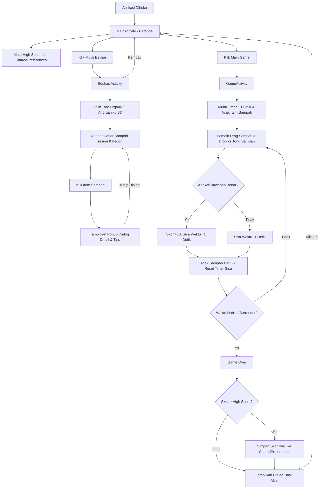

# Dokumentasi Teknis Aplikasi EcoPilah (EcoKan)

Dokumen ini berisi penjelasan mendalam mengenai alur kerja aplikasi (*app workflow*), arsitektur folder dan file, cara kerja sintaksis/kode, serta teknologi (*tools*) yang digunakan dalam pengembangan aplikasi Android **EcoPilah**.

---

## 1. Teknologi & Alat Pengembangan (Tools)

Aplikasi **EcoPilah** dikembangkan menggunakan ekosistem pengembangan Android modern dengan spesifikasi berikut:

| Kategori | Teknologi / Alat | Kegunaan |
| :--- | :--- | :--- |
| **IDE** | Android Studio | Lingkungan pengembangan utama (*Integrated Development Environment*). |
| **Bahasa Pemrograman** | Java (JDK 8 / 1.8) | Digunakan untuk mengimplementasikan seluruh logika bisnis, interaksi, dan alur aplikasi. |
| **Build System** | Gradle (Kotlin DSL - `.gradle.kts`) | Mengatur kompilasi proyek, konfigurasi SDK, dan manajemen dependensi secara otomatis. |
| **Dependency Management** | Version Catalog (`libs.versions.toml`) | Manajemen versi dependensi terpusat yang dideklarasikan pada direktori `gradle/`. |
| **UI Framework** | Android XML View System | Pembuatan antarmuka pengguna (UI) menggunakan file XML deklaratif. |
| **Desain & Tema** | Material Design 3 (Material 3) | Desain komponen UI yang modern, adaptif, dan responsif. |
| **Penyimpanan Lokal** | `SharedPreferences` | Digunakan untuk menyimpan dan memuat skor tertinggi (*high score*) game secara persisten. |

---

## 2. Struktur Folder & File yang Berpengaruh

Berikut adalah struktur folder penting dalam proyek Android Studio ini beserta peranannya terhadap sistem kerja aplikasi:

```text
c:\Development\Android\AndroidStudio\
├── gradle/                          # Konfigurasi Gradle Wrapper & Version Catalog
│   └── libs.versions.toml           # Deklarasi pusat versi dependensi & plugin
├── app/                             # Modul Utama Aplikasi
│   ├── build.gradle.kts             # Konfigurasi build level modul (SDK, package, dependencies)
│   └── src/
│       └── main/
│           ├── AndroidManifest.xml   # Manifest utama pendaftaran Activity & Tema aplikasi
│           ├── java/                # Kode sumber Java
│           │   ├── com/arkan/ecoKan/
│           │   │   └── view/
│           │   │       └── MainActivity.java  # File transisi/refactoring (tidak aktif sebagai launcher)
│           │   └── com/example/ecopilah/
│           │       ├── MainActivity.java      # Activity Utama (Halaman Home & Launcher)
│           │       ├── EdukasiActivity.java   # Activity Modul Belajar/Katalog Sampah
│           │       └── GameActivity.java      # Activity Modul Game Memilah Sampah
│           └── res/                 # Resource UI (Gambar, Tata Letak, Nilai)
│               ├── drawable/        # Aset gambar (.png) & latar belakang kustom (.xml)
│               ├── layout/          # Desain UI halaman XML
│               │   ├── activity_main.xml       # Layout halaman Home
│               │   ├── activity_edukasi.xml    # Layout halaman Katalog Edukasi
│               │   ├── activity_game.xml       # Layout halaman Game Pemilahan
│               │   ├── dialog_waste_tip.xml    # Layout dialog detail popup sampah
│               │   └── item_waste_card.xml     # Layout kartu item sampah dalam grid
│               └── values/          # Kumpulan nilai statis (warna, teks, tema)
│                   ├── colors.xml   # Definisi warna Material 3 (Tema Hijau/Alam)
│                   ├── strings.xml  # String aplikasi (e.g. Nama Aplikasi)
│                   └── themes.xml   # Tema dasar aplikasi
```

### Penjelasan File Kode & Layout Utama:

1. **`AndroidManifest.xml`**
   * **Fungsi**: File konfigurasi utama Android. Mengatur ikon aplikasi (`@drawable/icon`), tema dasar (`@style/Theme.EcoKan`), dan mendeklarasikan ketiga Activity.
   * **Penting**: Menetapkan `com.example.ecopilah.MainActivity` sebagai Activity pertama yang dijalankan saat aplikasi dibuka (*LAUNCHER*).

2. **`MainActivity.java` & `activity_main.xml`**
   * **Fungsi**: Berperan sebagai beranda/halaman utama.
   * **Logika Kerja**: 
     * Mengambil dan memformat data *High Score* dari `SharedPreferences`.
     * Menampilkan tips memilah sampah pada banner bawah.
     * Mengarahkan pengguna ke halaman belajar (`EdukasiActivity`) atau bermain (`GameActivity`) menggunakan objek `Intent` saat card diklik.

3. **`EdukasiActivity.java` & `activity_edukasi.xml`**
   * **Fungsi**: Menampilkan katalog sampah berdasarkan kategorinya (Organik, Anorganik, B3).
   * **Logika Kerja**: 
     * Menginisialisasi list data sampah statis.
     * Mengatur sistem navigasi tab (Organik, Anorganik, B3) dan secara dinamis menggambar ulang daftar sampah menggunakan adapter/inflater manual dalam layout linear baris.
     * Membuka popup modal kustom (`dialog_waste_tip.xml`) saat salah satu item diklik untuk menampilkan tips pengolahan sampah tersebut.

4. **`GameActivity.java` & `activity_game.xml`**
   * **Fungsi**: Tempat berlangsungnya permainan pemilahan sampah dengan waktu terbatas (*time attack*).
   * **Logika Kerja**:
     * Mengimplementasikan interaksi **Drag-and-Drop** di mana gambar sampah dapat di-drag dan di-drop ke salah satu dari 3 tong sampah (Organik, Anorganik, B3).
     * Mengelola sistem skor (Benar = +10 skor & +1 detik, Salah = -1 detik).
     * Mengelola penghitung waktu mundur (*CountDownTimer*) berdurasi awal 10 detik yang bertambah atau berkurang sesuai respon pemain.
     * Menyimpan skor tertinggi baru ke `SharedPreferences` jika permainan berakhir (*Game Over*).

---

## 3. Alur Kerja Aplikasi (App Workflow)

Alur kerja aplikasi secara visual digambarkan dalam diagram alir berikut:



---

## 4. Cara Kerja Sintaksis & Kode Logika (Syntax Mechanics)

Berikut adalah rincian cara kerja kode yang berpengaruh pada mekanisme kerja aplikasi:

### A. Sistem Navigasi & Penyimpanan Data Lokal (MainActivity)

MainActivity memuat High Score dari `SharedPreferences` secara asinkron setiap kali halaman ditampilkan kembali (`onResume`).

```java
// Membaca High Score dari penyimpanan lokal SharedPreferences
private void loadAndDisplayHighScore() {
    // Membuka file preferences "EcoPilahPrefs" dengan mode privat (hanya bisa diakses aplikasi ini)
    SharedPreferences prefs = getSharedPreferences("EcoPilahPrefs", MODE_PRIVATE);
    int highScore = prefs.getInt("HIGH_SCORE", 0); // Nilai default adalah 0 jika belum ada data

    // Memformat angka sesuai dengan standar Indonesia (misal: 1.000 bukan 1000)
    NumberFormat nf = NumberFormat.getNumberInstance(new Locale("id", "ID"));
    String formattedScore = nf.format(highScore) + " Poin";

    if (tvScore != null) {
        tvScore.setText(formattedScore);
    }
}
```

* **Penjelasan Sintaks**: 
  * `getSharedPreferences("EcoPilahPrefs", MODE_PRIVATE)` membuka data XML lokal bernama `EcoPilahPrefs`.
  * `onResume()` dipanggil setiap kali pengguna kembali ke halaman ini (misal, setelah keluar dari game), menjamin tampilan skor selalu aktual tanpa harus me-restart aplikasi.

---

### B. Dynamic Rendering & Kustomisasi Dialog (EdukasiActivity)

Di halaman edukasi, sistem merender tata letak (*layout*) secara dinamis menggunakan perulangan Java tanpa bergantung pada RecyclerView yang kompleks, guna menjaga kesederhanaan kode.

```java
// Membuat baris baru berupa LinearLayout Horizontal untuk menampung maksimal 2 kartu sampah
private LinearLayout createRow() {
    LinearLayout row = new LinearLayout(this);
    row.setOrientation(LinearLayout.HORIZONTAL);
    row.setBaselineAligned(false);
    row.setWeightSum(2f); // Distribusi berat seimbang untuk 2 kolom
    row.setPadding(0, 0, 0, dp(14));
    row.setLayoutParams(new LinearLayout.LayoutParams(
            ViewGroup.LayoutParams.MATCH_PARENT,
            ViewGroup.LayoutParams.WRAP_CONTENT
    ));
    return row;
}

// Inflate item layout dan isi konten berdasarkan data objek WasteInfo
private View createWasteCard(WasteInfo item) {
    // Inflate layout kartu xml item_waste_card
    View card = LayoutInflater.from(this).inflate(R.layout.item_waste_card, gridContainer, false);
    card.setLayoutParams(createCardLayoutParams());
    card.setOnClickListener(v -> showWasteDialog(item)); // Tampilkan dialog detail saat diklik

    // Menghubungkan komponen view
    ImageView image = card.findViewById(R.id.img_waste);
    TextView title = card.findViewById(R.id.tv_waste_title);
    TextView tag = card.findViewById(R.id.tv_waste_tag);

    // Set resource data ke view
    image.setImageResource(item.imageResId);
    title.setText(item.title);
    tag.setText(item.tag);
    tag.setTextColor(ContextCompat.getColor(this, item.accentColorResId));

    return card;
}
```

* **Penjelasan Sintaks**:
  * `LayoutInflater.from(this).inflate(...)` mengonversi file layout XML `item_waste_card` menjadi objek Java `View`.
  * `row.setWeightSum(2f)` berpasangan dengan berat layout item `1f` memastikan bahwa jika hanya terdapat satu kartu pada suatu baris, kartu tersebut akan memakan tepat setengah lebar layar, sementara sisanya diisi oleh elemen kosong (*spacer*) agar penataan grid tetap presisi.

---

### C. Mekanisme Drag and Drop & Micro-interactions (GameActivity)

Mekanisme utama permainan dikendalikan melalui API Drag and Drop bawaan Android SDK.

#### 1. Memulai Proses Drag (OnTouchListener)
Ketika pemain menyentuh gambar sampah, aplikasi mendeteksi aksi sentuhan (`ACTION_DOWN`) dan memulai proses *drag*.

```java
imgSampah.setOnTouchListener((view, event) -> {
    if (gameFinished || currentItem == null) {
        return false;
    }

    if (event.getAction() == MotionEvent.ACTION_DOWN) {
        // Menyimpan data kategori sampah (misal: "organik") untuk diverifikasi saat di-drop
        ClipData data = ClipData.newPlainText("category", currentItem.category);
        
        // Membuat bayangan grafis visual sampah yang mengikuti jari pengguna
        View.DragShadowBuilder shadowBuilder = new View.DragShadowBuilder(view);
        
        // Memulai proses drag and drop
        view.startDragAndDrop(data, shadowBuilder, currentItem, 0);
        return true;
    }
    return false;
});
```

#### 2. Mendeteksi Feedback Drag & Drop pada Tong Sampah (OnDragListener)
Setiap tong sampah mendengarkan event drag yang sedang berlangsung melalui `OnDragListener`.

```java
View.OnDragListener binDragListener = (view, event) -> {
    switch (event.getAction()) {
        case DragEvent.ACTION_DRAG_STARTED:
            return true; // Menandakan tong siap menerima event drag
            
        case DragEvent.ACTION_DRAG_ENTERED:
            // Efek Mikro-Animasi: Tong sampah membesar 8% saat sampah didekatkan ke area tong
            view.animate().scaleX(1.08f).scaleY(1.08f).setDuration(100).start();
            return true;
            
        case DragEvent.ACTION_DRAG_EXITED:
        case DragEvent.ACTION_DRAG_ENDED:
            // Mengembalikan ukuran tong ke bentuk semula saat sampah menjauh atau proses selesai
            view.animate().scaleX(1f).scaleY(1f).setDuration(100).start();
            return true;
            
        case DragEvent.ACTION_DROP:
            // Mengembalikan ukuran tong
            view.animate().scaleX(1f).scaleY(1f).setDuration(100).start();
            
            // Mengambil kategori tong sampah tempat item dilepas (drop)
            handleDrop(getCategoryForBin(view.getId()));
            return true;
            
        default:
            return false;
    }
};
```

* **Penjelasan Sintaks**:
  * `view.animate().scaleX(1.08f)...` menyajikan interaksi mikro (*micro-interactions*) yang membuat elemen UI terasa "hidup" dan responsif terhadap sentuhan jari pengguna.
  * `ACTION_DROP` memicu penanganan logika drop melalui metode `handleDrop()`. Kategori target tong dibandingkan dengan kategori sampah sesungguhnya (`currentItem.category`).

---

### D. Pengendali Waktu & Logika Game Over (GameActivity)

Timer permainan berjalan secara dinamis menggunakan modifikasi `CountDownTimer`. Setiap kali jawaban benar diberikan, sisa waktu akan bertambah, yang mengharuskan timer lama dihentikan dan timer baru dimulai kembali dengan sisa waktu yang telah ditambahkan.

```java
private void startTimer(long durationMs) {
    cancelTimer(); // Menghentikan timer yang sedang berjalan untuk menghindari penumpukan thread timer
    timeRemainingMs = durationMs;
    updateTimerText();

    countDownTimer = new CountDownTimer(timeRemainingMs, 1000L) {
        @Override
        public void onTick(long millisUntilFinished) {
            timeRemainingMs = millisUntilFinished;
            updateTimerText();
        }

        @Override
        public void onFinish() {
            timeRemainingMs = 0L;
            updateTimerText();
            gameOver(); // Memicu Game Over saat waktu habis
        }
    }.start();
}
```

* **Penjelasan Sintaks**:
  * `CountDownTimer(timeRemainingMs, 1000L)` menghitung mundur setiap 1 detik (1000 milidetik).
  * Aksi penambahan waktu (`timeRemainingMs += TIME_BONUS_MS`) terjadi di `handleDrop()`. Metode `restartTimer()` kemudian memanggil `startTimer(timeRemainingMs)` untuk melanjutkan perhitungan mundur dengan nilai sisa waktu yang baru.

---

## 5. Kesimpulan Kerja Sistem

Aplikasi **EcoPilah** memiliki arsitektur **Model-View** sederhana (dengan persiapan ke arah MVVM melalui folder `viewmodel` yang disediakan). Interaksi antarhalaman diatur oleh Android `Intent` standar. 

Sistem game menggunakan koordinasi yang baik antara:
1. **Event Gesture & Drag API** untuk pemilahan interaktif.
2. **CountDownTimer** yang fleksibel untuk manajemen batas waktu yang dinamis.
3. **SharedPreferences** untuk menyimpan pencapaian tertinggi pemain secara persisten.

Seluruh visualisasi diatur melalui tata letak XML Material 3 dengan warna dominan hijau alam (`#0D631B`) yang melambangkan misi ekologis aplikasi dalam mendidik masyarakat memilah sampah.
